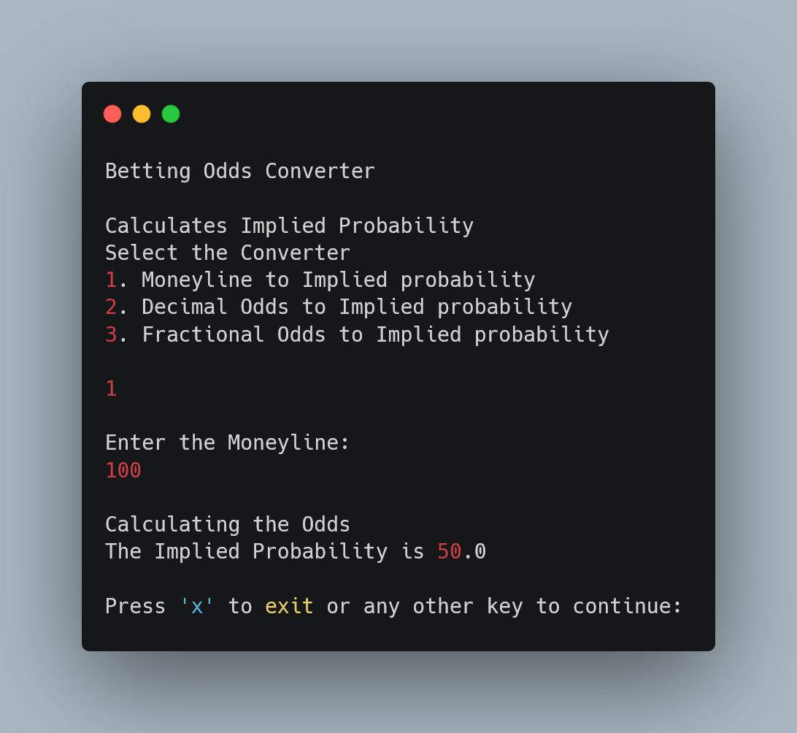

# Betting Odds Calculator

A Command Line Interface (CLI) application that converts various types of betting odds into implied probabilities. Implied probability provides insight into the likelihood of winning as determined by the betting market.

## Table of Contents

- [About](#about)
- [Supported Betting Odds](#supported-betting-odds)
- [Getting Started](#getting-started)
- [Installation](#installation)
- [Usage](#usage)
- [Contributing](#contributing)
- [License](#license)

## About

The Betting Odds Calculator is a Scala project that allows users to easily convert different types of betting odds into implied probabilities. It provides valuable insights for bettors, helping them make informed decisions based on market odds.

## Supported Betting Odds

The application supports three widely used types of betting odds:

1. **American Moneyline:**
   - Denoted by an integer number.
   - A positive American Moneyline indicates the potential profit when wagering $100.
   - A negative American Moneyline indicates the amount needed to wager to win $100.

2. **Decimals:**
   - Decimal odds quote the potential returns that would be paid if the bet succeeds in your favor.

3. **Fractions:**
   - Fractional odds, like decimal odds, quote the potential returns if the bet succeeds.
   - Presented in a fractional format.

## Getting Started

To get started with the Betting Odds Calculator, you'll need to install it on your local machine.

## Installation

1. **Prerequisites:**
   - Ensure you have Java 11 or a compatible version installed on your system.

2. **Download the JAR file:**
   - You can download the executable JAR file from the [releases page](https://github.com/SanjayShetty01/betting-odds-converter/releases).

3. **Run the Calculator:**
   - Open your terminal or command prompt.
   - Navigate to the directory containing the downloaded JAR file.
   - Run the calculator using the following command:

     ```shell
     java -jar betting-odds-calculator.jar
     ```

## Usage

#### Screenshot


1. **Select Betting Odds Type:**
   - Choose the type of betting odds you want to convert (American Moneyline, Decimals, or Fractions).

2. **Enter Odds Value:**
   - Input the odds value associated with your bet.

3. **Implied Probability:**
   - The application will calculate and display the implied probability of your selected odds.

4. **Repeat as Needed:**
   - You can use the calculator to convert odds as often as you like.

## Contributing

Contributions to this project are welcome. Feel free to open issues or submit pull requests to enhance the functionality or fix any bugs.

## License

This project is licensed under the MIT License.
